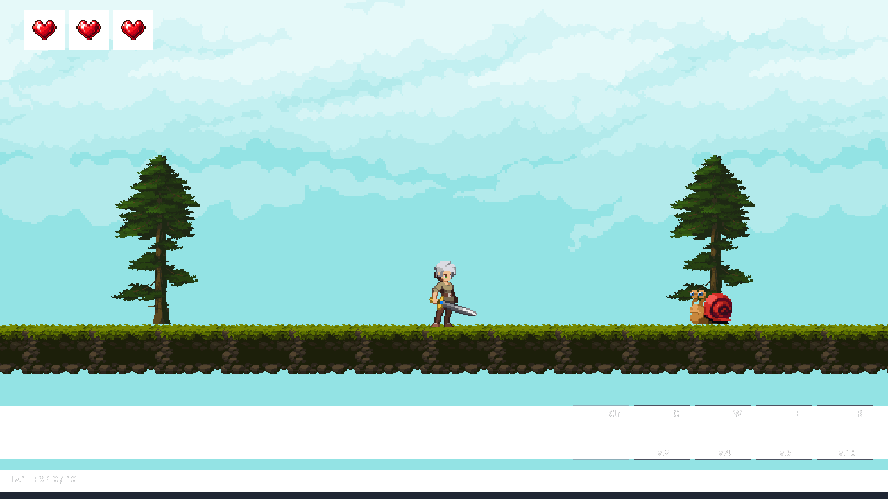
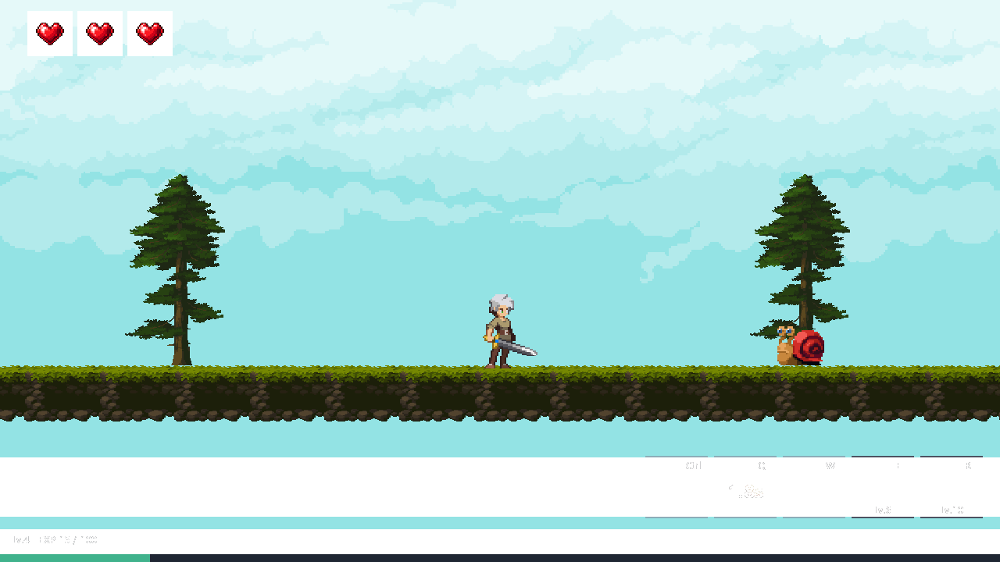
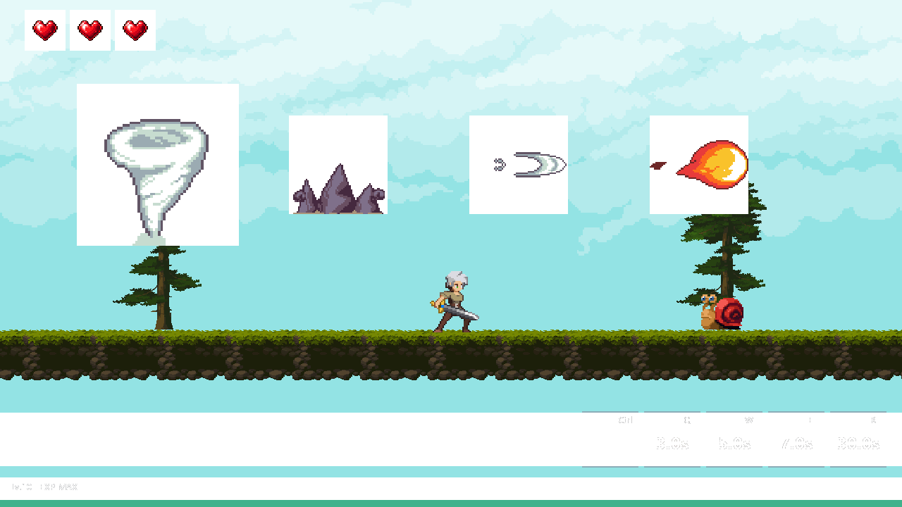
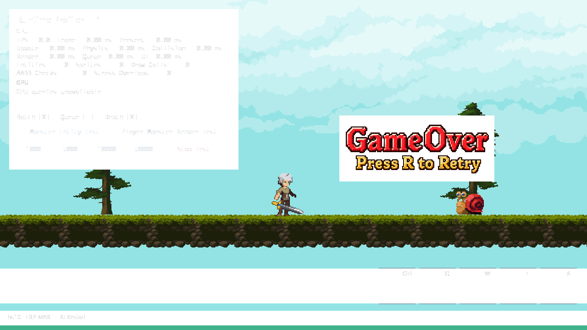

# 성장·스킬·Pool·HUD 구현 기록

작성일: 2026.09.26. 기존 09.27~28 통합 계획을 사용자 요청으로 현재 작업에서 구현. 커밋·릴리스 미진행.

## 문제

기존 Ctrl 공격만으로 구성된 전투에 성장·스킬 해금·투사체 수명 관리가 필요. Monster Pool 재사용 시 동일 주소의 새 사용 회차를 구분하고, 처치 EXP와 사망 연출을 분리할 필요.

## AI 활용과 판단

명세의 PlayerAttack composition, PlayerStat/EnemyStat, 불변 JSON 정의, World 소유 Pool/Handle 권장안 적용. UI 범위를 잠시 보류했다가 사용자의 최종 지시로 성장·공격 HUD까지 포함. 네트워크·Post Processing은 후속 유지.

## 구현

| 입력 | 해금 | 쿨타임 | 동작 |
| --- | ---: | ---: | --- |
| Ctrl | Lv.1 | 별도 쿨타임 없음 | 기존 근접 공격, 실제 피해 성공 시 한 대상 명중 기록 |
| Q | Lv.2 | 3초 | 직선 화염구, 가장 먼저 접촉한 적에서 반환 |
| W | Lv.4 | 5초 | 관통 바람, Monster 사용 회차당 접촉 1회 |
| E | Lv.6 | 7초 | 전방 지면 가시, 3~5번 프레임 시간 구간 판정 |
| R | Lv.10 | 30초 | 느린 회오리, 4초 동안 0.5초 간격으로 최대 8회 피해 |

- 시작 Lv.1/EXP 0, 최대 Lv.10. 초과 EXP 이월과 한 번의 보상으로 여러 레벨 상승 처리
- 필요 EXP 10/30/60/100/150/210/280/360/450, 적 처치 EXP는 Lv.1~10에서 5/10/15/20/25/30/35/40/45/50
- 동일 레벨 적 기준으로 Lv.1→2는 2마리, Lv.2→3은 3마리, Lv.9→10은 10마리 필요. 낮은 레벨로 이미 Spawn된 적은 기존 보상을 유지하므로 실제 처치 수가 달라질 수 있음
- Monster 레벨은 Spawn 시 Player 레벨로 고정. 살아 있는 적은 이후 Player 성장과 독립
- 현재 HP 소유자는 Character 유지. maxHp 원본은 Stat JSON으로 이동, 기본값 3 유지
- Killed 결과에서 EXP 1회 지급. 사망 애니메이션 종료는 기존 killCount·아이템·Respawn만 처리
- 사망 시 성장 상태 보존, R 재시작은 새 게임으로 Level/EXP·HP·쿨타임·Pool 초기화
- QWER는 눌린 순간에 발동. 공중·피격·사망·시전·Stress 중 거부. 동시 입력은 Q→W→E→R 우선, Ctrl보다 스킬 우선
- 실패 시 쿨타임 미소비. Q가 Hurt 적에 접촉하면 반환하되 피해/효과는 생략. R은 Hurt를 재시작하지 않고 주기 피해 적용

### 호출 흐름

```text
Application 시작
  → JobSystem: GameData.json + PlayerStat.json + EnemyStat.json 읽기·검증
  → future: 완성된 불변 GameData 전달
  → Main: PNG/D3D 리소스 생성 → GameWorld 초기화

프레임
  → 키 상태 1회 수집 → AttackInput의 에지/우선순위/재시작 판정
  → 기존 Entity·Physics·Ground 갱신
  → PlayerAttack: 해금·상태·쿨타임 검사 → World Pool 대여 → 시전 시작
  → 근접/몸체 충돌 → 기존 활성 스킬의 경로/시간 판정
  → ApplyDamageToMonster → Killed일 때 EXP → 레벨업
  → 스킬/효과 반환 → 기존 Monster·Item Pool 처리
  → Application: 성장/공격 값 복사 → UIManager → CombatHud → Renderer
```

새로 생성한 스킬과 효과는 다음 프레임부터 시간을 진행. 장기 참조는 Handle, Lookup 포인터는 현재 처리 구간에서만 사용. Worker는 게임 객체·Pool·렌더링 상태를 변경하지 않음.

### 파일별 역할과 Visual Studio 확인 위치

| 파일 | 변경 내용·확인할 부분 |
| --- | --- |
| `Game/Stats/StatDefinitions.h` | 불변 레벨 테이블과 초기 상태 정의 |
| `Game/Stats/PlayerStat.h/.cpp` | Level/EXP, 잔여 보상을 필요량씩 소비하는 다중 레벨업, Reset |
| `Game/Stats/EnemyStat.h` | Spawn 레벨·HP·처치 EXP 스냅샷 |
| `Game/Combat/AttackDefinition.h` | 슬롯·수치·키·해금·시각 프레임·HUD 값 타입 |
| `Game/Combat/AttackInput.h` | Win32와 분리한 입력 에지·동시 입력·R 재시작 판정 |
| `Game/Combat/PlayerAttack.h/.cpp` | 공통 사용 검사·쿨타임, 근접/투사체/지면/주기 공격 상속 |
| `Game/Combat/Damage.h` | Ignored/Applied/Killed 결과와 일반/주기 피해 구분 |
| `Game/Combat/PoolHandle.h` | storageId·slot·generation, Skill/Effect 타입 구분 |
| `Game/Combat/WorldSlotPool.h` | 비소유 고정 슬롯, O(1) 대여·조회·반환, 세대/저장소 검증 |
| `Game/Combat/SkillObject.h/.cpp` | 스킬별 실행 상태·명중 회차·원본 PNG 프레임 출력·반환 정리 |
| `Game/Effects/HitEffect.h/.cpp` | 피해 없는 1회 효과, 수명 종료·반환 정리 |
| `Game/Data/GameData.h/.cpp` | 3개 JSON 일괄 로딩·교차 검증, 정적 정의 소유 |
| `Game/Entity/Character.h/.cpp` | 공통 DamageResult 반환 계약, 현재 HP 소유 유지 |
| `Game/Player.h/.cpp` | Stat/공격 배열 소유, SkillCast FSM, 성장·해금·HUD 값 전달 |
| `Game/Monster.h/.cpp` | EnemyStat, SpawnSerial, 사용 회차당 보상 1회, 명시적 Idle 클립 초기화 |
| `Game/World/GameWorld.h/.cpp` | 월드 소유권·프레임 연결·Reset·투명 스킬 레이어 |
| `Game/World/WorldCombat.cpp` | 신규 전투 책임 분리. Pool 생성·입력·Spawn·보상·Swept AABB·E/R 판정 |
| `Game/Animation/Animator.cpp` | 긴 dt에서 유한 산술 연산으로 프레임 진행 |
| `Engine/Core/CombatHud.h/.cpp` | 표시 전용 값과 텍스트 캐시. Level/EXP 바, 슬롯 5개, 상태/시간 표시 |
| `Engine/Core/UIManager.h/.cpp` | CombatHud 소유·호출. F1과 독립 표시, Profiler와 HP/GameOver 영역 분리 |
| `Engine/Core/Application.cpp` | 렌더 전 HUD 갱신, 새 투명 레이어의 Depth ON/OFF 출력 연결 |
| `Assets/Data/GameData.json` | schemaVersion 3, 공격·아이콘·효과·Pool 설정 |
| `Assets/Data/PlayerStat.json`, `EnemyStat.json` | schemaVersion 1의 성장 정의. 진행 상황 세이브 파일 아님 |
| `Assets/Skills/` | 실제 참조 PNG 33개와 원본 CC0 라이선스만 포함 |
| `DX11ScrollRPG.vcxproj/.filters` | 신규 C++·JSON·PNG 등록. 기존 소스/헤더/리소스 필터 아래 Stats/Combat/Effects/Skills 구성 |
| `Tests/CombatTests.cpp`, `CombatTests.vcxproj` | 실제 게임 소스를 사용하는 별도 회귀 검증. 기본 게임 솔루션 빌드에는 미포함 |

### 새 개념

- **Composition:** Player가 Stat과 공격 객체를 멤버로 소유. 공격 역할은 상속으로 나누되 같은 행동인 Q/W는 설정만 다르게 구성
- **Generation Handle:** 주소 대신 슬롯과 사용 회차로 조회. 반환 후 같은 객체를 재사용해도 이전 Handle은 실패
- **Swept AABB:** 프레임 끝 위치만 보지 않고 두 객체의 상대 이동 경로를 검사. 빠른 투사체의 통과 누락 방지
- **값 스냅샷:** UI에는 게임 객체 포인터 대신 표시값 복사. UI에서 성장·해금 조건 재계산 금지
- **GDI → D3D 텍스처:** 기존 UI 방식을 유지. 텍스처는 재사용하고 문자열이 바뀔 때만 갱신, 시간 표시는 0.1초 단위

### 명세에서 구체화한 부분

- 가로 시트를 새로 만들지 않고 원본 64×64 PNG를 개별 프레임으로 사용. Fire_Ball 1~5, Wind 1~6, Earth_Spike 1~9, Tornado 1~6, Explosion 1~7. Fire_Ball 소멸 프레임은 반복에서 제외
- 기존 SpriteId 17개는 유지, 스킬 프레임은 로더가 별도 ID 영역에서 등록. HUD 아이콘 ID 1000~1004 추가, 총 55개 텍스처 경로
- 신규 WorldCombat.cpp와 CombatHud 클래스로 월드 전투 처리·UI 그리기 책임 분리
- PlayerStat::AddExperience는 상태를 갱신하고 Player가 적용 HP를 동기화. 별도 LevelUpResult/event 없이 현재 규모에 맞춰 직접 연결

## 검증

- x64 Debug / Release 게임 빌드 성공
- 실제 게임 소스 기반 자동 검증 **204개 통과**
- Lv.1~10의 해금 조건, EXP 임계/이월/최대값, Spawn 보상, 동시 처치·사망 연출·재사용 후 1회 지급
- Q 가장 가까운 적 우선, W 관통·회차당 1회, E 긴 프레임의 유효 구간, R 최초/마지막 틱·Hurt 중 피해
- Pool 고갈 시 쿨타임 미소비, 효과 Pool 고갈 시 피해 유지, 죽음/Reset 반환, stale/foreign/invalid Handle 조회 실패
- 키 유지·상승 에지·우선순위·포커스 복귀·R 재시작 소비. Win32 실제 키보드 조작은 별도 확인 필요
- JSON 음수 EXP·중복 레벨·초기 EXP 오류·이전 스키마·중복 키 거부 및 정상 로딩 복구
- DX11 WARP로 실제 Renderer/셰이더/ResourceManager/UIManager 실행, 전체 이미지 로딩 및 1280×720 PNG 출력
- 새 투명 스킬의 Depth ON 상태에서 Render Queue ON/OFF 출력 픽셀 일치 확인
- 새 HUD의 레벨·EXP·쿨타임·잠금·MAX·사망/Profiler 표시 이미지 확인. 스프라이트는 33/33개만 참조, 미사용 PNG 없음
- 프로젝트 경로·필터·문서 링크·git diff 공백 검사

재현: Visual Studio Developer PowerShell에서 저장소 루트를 작업 디렉터리로 설정.

```powershell
msbuild Tests/CombatTests.vcxproj /p:Configuration=Debug /p:Platform=x64 /m
./Tests/build/CombatTests.exe
```

검증 데이터·실행 파일·렌더 원본은 git 제외 경로 `Tests/build/`에 생성. 제품 JSON은 수정하지 않으며 오류 입력은 해당 폴더의 복사본 사용.

## 결과 이미지

아래는 실제 렌더러의 WARP 검증 장면. 직접 플레이 캡처나 성능 측정 자료가 아님. 레벨과 배치는 검증용이며 Lv.4 장면의 1.8초는 표시 검증용 값.









## 한계와 후속

- 실제 키보드로 연속 플레이, 타격감·레벨업 속도·시전 크기 밸런스 확인은 사용자 플레이 검토 단계
- WARP 출력 검증이며 실제 GPU/디스플레이 전체 회귀와 성능 개선 측정은 미실행
- 세대·SpawnSerial·저장소 ID 고갈 시 재사용 중단 구현. uint64 최대값까지의 실횟수 반복 검증 미실행
- Pool 크기 고정, 게임 중 객체 삭제·네트워크 동기화·진행 저장·핫 리로드·키 변경 UI 미지원
- 원본 프레임별 텍스처 전환 비용 존재. 이 작업에서 Atlas·성능 최적화 효과를 주장하지 않음
- 1280×720 고정 창 기준 HUD. 해상도 대응·추가 시전 연출은 후속

## 아이콘 HUD 개편

### 요구와 선택

우하단 스킬 UI, 최하단 EXP, 생성 아이콘, 자물쇠 잠금, 우상단 단축키, 중앙 남은 초와 시계방향 쿨타임 표시 반영. 기존 GDI 글자 텍스처와 Sprite Batch 유지. 별도 UI 셰이더 대신 정사각형을 덮는 삼각형 부채꼴 사용.

### 파일과 호출 흐름

| 파일 | 변경과 확인 위치 |
| --- | --- |
| `Assets/UI/SkillIcons/*.png` | 내장 imagegen으로 생성한 Normal·FireBall·Wind·EarthSpike·Tornado 정사각형 아이콘 |
| `Assets/Data/GameData.json`, `Game/Data/GameData.cpp` | schemaVersion 3, 공격별 icon 경로 필수 검증, 기존 리소스 로딩 경로에 등록 |
| `Game/Combat/AttackDefinition.h`, `Game/Player.cpp` | 정의의 icon ID를 표시용 AttackHudData에 복사 |
| `Engine/Core/CombatHud.cpp/.h` | DrawSkills 우하단 76×76 아이콘, EXP 패널과 16px 기준 간격, DrawLock 자물쇠, DrawExperience 최하단 10px 바. 잠금 판단은 공통 GetAvailability 결과 사용 |
| `Engine/Graphics/UIRadialFill.h` | Remaining: 남은 비율에서 12시 기준 시계방향 경계와 모서리 계산 |
| `Engine/Graphics/Renderer.cpp/.h` | DrawUIIcon·DrawUICooldown·DrawUITriangle, 글자 텍스처 영역을 나눠 그릴 UV 인자 추가 |
| `Engine/Core/UIManager.cpp` | F1 패널 표시 중 하트 위치를 패널과 스킬 사이로 이동 |
| `Tests/CombatTests.cpp` | 회전 방향·종료·면적 검증과 실제 WARP 픽셀 검사 |

Application → UIManager → CombatHud에 값 스냅샷 전달. CombatHud가 Renderer로 아이콘·배경·회전 영역·글자 순서 출력. UI에서 공격 상태·쿨타임 변경 없음.

**삼각형 부채꼴:** 아이콘 중심과 사각형 외곽 점을 연결해 어두운 영역 구성. 100%일 때 전체를 덮고 시간이 흐르면 12시부터 시계방향으로 걷히며 0%에서 삼각형 생성 중단. 기존 사각형 배치 인덱스를 재사용하고 두 번째 삼각형은 면적 0으로 처리.

**UV 영역:** 하나의 글자 텍스처에 슬롯 내부 글자와 성장 글자를 저장. 각 영역의 UV만 선택해 우하단 아이콘·최하단 EXP 패널에 출력. 쿨타임 도형은 매 프레임 갱신, 중앙 숫자는 올림한 0.1초 단위 문자열이 바뀔 때만 업로드. 0초에서 숫자·쿨타임 오버레이 제거.

Visual Studio의 `헤더 파일/Engine/Graphics`에 UIRadialFill.h, `리소스 파일/UI`에 아이콘 5개 등록. 새 cpp 추가 없음. `DrawSkills`, `Remaining`, `DrawUITriangle` 순서로 확인 권장.

### 검증과 자료

- 실제 DX11 WARP 픽셀로 100%·75%·50%·25%·0%의 시계방향 사분면과 완료 시 제거 확인
- 음수·0·NaN 비율 처리, 사분면 면적·정점 방향 확인
- Level1 잠금·Level4 쿨타임·MAX·사망/F1 출력 확인
- 생성 도구·최종 프롬프트: [아이콘 생성 기록](SkillIconGeneration.md)
- 렌더 검증용 장면이며 실제 키보드 플레이와 구분

### HUD 간소화 반영

- 이름 상단바·기본 쿨타임 하단바 제거, 아이콘 행을 우하단 EXP 패널 위로 이동
- 잠긴 스킬만 자물쇠와 바로 아래 Lv. 조건 표시, 해금 시 두 표시 제거
- 쿨타임 중에만 중앙 잔여 초 표시, 기존 시계방향 마스크 유지
- 실제 Fire_Ball·Wind·Earth_Spike·Tornado 프레임과 Player Attack을 참조해 제한된 팔레트·큰 픽셀의 아이콘으로 교체. 생성 PNG의 투명 영역은 HUD의 공통 어두운 바탕 위에 합성
- CombatHud.cpp의 Update는 표시 문구, UploadText는 아이콘 내부 좌표, SkillX/SkillY는 우하단 배치 담당. CombatHud.h에 SkillY 선언 추가
- 기존 파일 수정과 동일 PNG 경로 교체, 솔루션·필터 추가 없음
