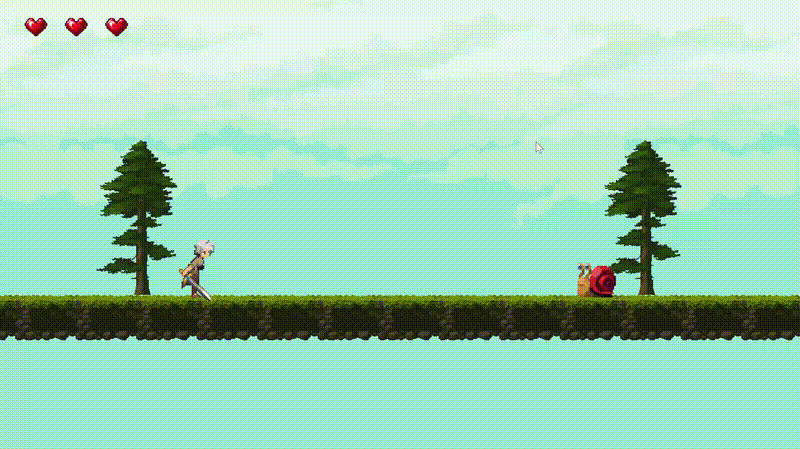
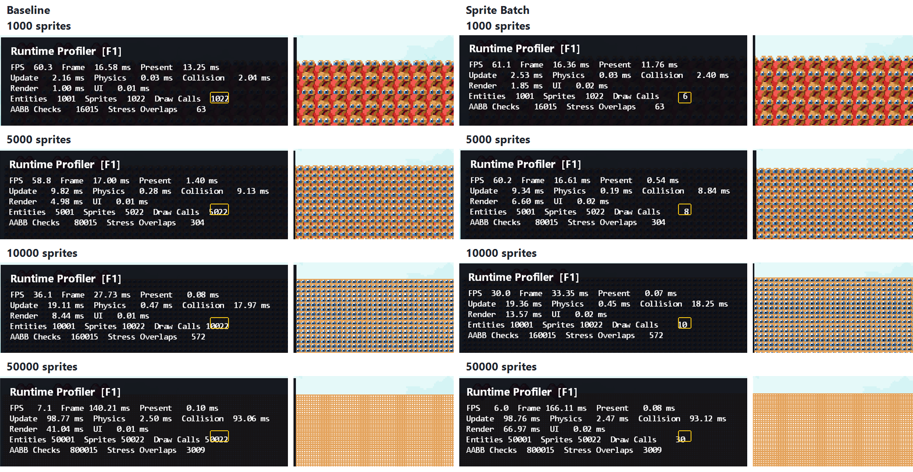
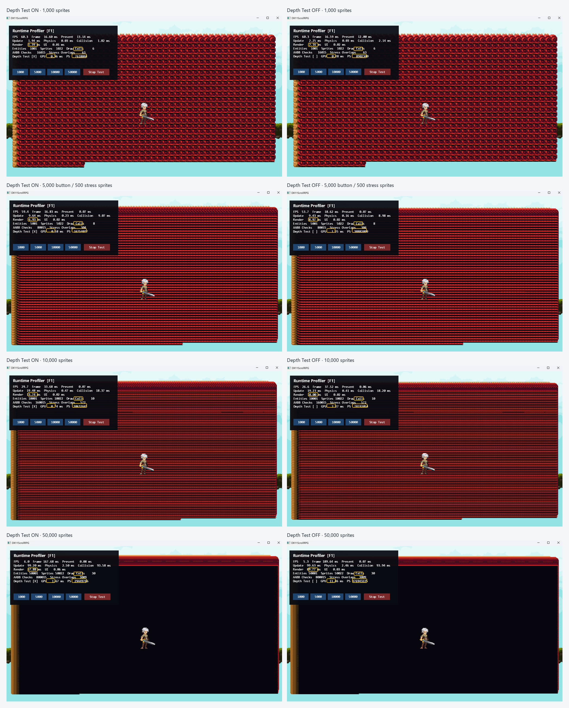

# DirectX 11 2D Action Game

C++20과 DirectX 11로 개발한 2D 액션 게임 프로토타입. Win32 게임 루프와 렌더링 파이프라인부터 게임 시스템까지 직접 구현.



<p align="center">
  <a href="https://github.com/Yeop-Git/DX11ScrollRPG/releases/tag/v0.1.0">
    
  </a>
</p>

## 목차

- [프로젝트 정보](#project-information)
- [조작법](#controls)
- [기본: 직접 작성한 코드](#handwritten-foundation)
  1. [DirectX 11 렌더링](#directx-rendering)
  2. [렌더링·리소스·애니메이션 구조](#system-architecture)
  3. [객체·물리·충돌](#entity-physics-collision)
  4. [FSM 기반 전투](#fsm-combat)
  5. [Active 상태 기반 재사용](#object-reuse)
- [AI Sprint: 성능 분석과 렌더링 개선](#ai-sprint)
  1. [Profiler와 스트레스 테스트](#profiler-stress-test)
  2. [Sprite Batch](#sprite-batch)
  3. [Depth Test와 픽셀 처리량](#depth-test)
- [빌드 및 실행](#build-and-run)
- [프로젝트 구조](#project-structure)
- [에셋 크레딧](#asset-credits)

<a id="project-information"></a>
## 프로젝트 정보

| 구분 | 내용 |
| --- | --- |
| 플랫폼 | Windows PC |
| 장르 | 2D 액션 게임 |
| 개발 인원 | 1명 |
| 개발 기간 | 2026.08 ~ 2026.10 |
| 기술 | C++20, Win32 API, DirectX 11, HLSL, stb_image |

<a id="controls"></a>
## 조작법

| 키 | 동작 |
| --- | --- |
| `←` / `→` | 좌우 이동 |
| `Alt` | 점프 |
| `Ctrl` | 공격 |
| `R` | 사망 후 재시작 |
| `F1` | Profiler 및 스트레스 테스트 패널 표시 전환 |

<a id="handwritten-foundation"></a>
## 기본: 직접 작성한 코드

### 1. DirectX 11 렌더링

#### 개발 배경

게임 엔진이 처리하는 그래픽스 파이프라인과 GPU 리소스의 역할을 익히기 위해 스프라이트 렌더링 과정을 직접 구성.

#### 구현 내용

- Win32 윈도우 및 Direct3D 11 Device, Device Context, Swap Chain 초기화
- Vertex / Index Buffer, Input Layout, HLSL Vertex / Pixel Shader 연결
- Shader Resource View와 Sampler를 이용한 텍스처 및 스프라이트 시트 출력
- Point Sampling 기반 픽셀 아트 출력, 프레임 UV 계산 및 좌우 반전
- `ComPtr` 기반 DirectX COM 리소스 수명 관리

#### 한계 및 개선점

- 창 크기 변경에 따른 Render Target 및 Viewport 재설정 필요

<a id="system-architecture"></a>
### 2. 렌더링·리소스·애니메이션 구조

#### 개발 배경

초기 `Application`에 모여 있던 초기화·리소스·갱신·렌더링 책임을 분리하고, 게임 로직에서 DirectX API와 텍스처 경로에 대한 의존성을 제거.

#### 구현 내용

- `Application`: 시스템 초기화와 게임 루프 관리
- `GameWorld`: 게임 객체와 월드 갱신 관리
- `RenderInfo`: 게임 객체에서 Renderer로 전달하는 스프라이트 출력 정보
- `Renderer`: 렌더 정보 기반 DirectX 렌더 명령 처리
- `ResourceManager`: 텍스처와 Shader Resource View 보관 및 수명 관리
- `AnimationClip`: 프레임 수, 재생 시간, 스프라이트 크기, Offset 보관
- `Animator`: 프레임 진행, Loop 및 재생 종료 처리

#### 한계 및 개선점

- Character 코드에 정의된 애니메이션 데이터의 외부 파일 또는 Asset Table 분리 필요
- `Application`에 남아 있는 UI 연결의 별도 책임 분리 필요

<a id="entity-physics-collision"></a>
### 3. 객체·물리·충돌

#### 개발 배경

Player와 Monster 사이 중복된 이동·중력·충돌 처리를 정리하고, 객체 역할과 물리·충돌·수명 관리 책임을 분리.

#### 구현 내용

- `GameObject → Entity → Character` 계층으로 공통 객체·갱신 대상·전투 캐릭터 구분
- `Transform`: 위치와 스케일 보관
- `Physics`: 속도, 중력 및 지면 상태 보관
- `Collider`: 충돌 크기와 오프셋 기반 AABB 계산
- `GameWorld`: Physics 갱신, AABB 검사 및 지면 충돌 보정
- `gameObjects_`: `unique_ptr<GameObject>`를 이용한 객체 수명 소유
- 시스템별 목록: 소유 객체를 가리키는 비소유 포인터 보관

#### 한계 및 개선점

- 지면 착지 중심의 충돌 반응. 벽·천장 및 고속 이동 충돌 처리는 미지원
- 객체 삭제 시 시스템별 비소유 참조 목록 갱신 필요
- 객체 증가에 대비한 Broad Phase 도입 필요

<a id="fsm-combat"></a>
### 4. FSM 기반 전투

#### 개발 배경

여러 Boolean 조합에서 발생하는 상충 상태를 방지하고, 몸체 충돌과 공격 판정을 독립적으로 관리.

#### 구현 내용

- Player: Idle, Run, Jump, Attack, Dead 상태
- Monster: Idle, Chase, Hurt, Dead 상태
- Grounded 및 Velocity 기반 Player 이동 애니메이션 전환
- 공격 애니메이션의 유효 프레임에 한정한 HitBox 활성화
- 공격당 대상별 중복 피격 방지
- Player 피격 시 무적 시간, 점멸 및 Knockback 적용

#### 한계 및 개선점

- 상태 증가에 대비한 상태별 동작 또는 Controller 분리 검토
- 현재 공격당 한 대상만 피격 처리. 다중 대상 공격 지원 필요

<a id="object-reuse"></a>
### 5. Active 상태 기반 재사용

#### 개발 배경

Monster와 Item의 반복적인 생성·삭제로 발생하는 메모리 할당을 줄이고, 재사용 시 초기화와 정리 시점을 명확히 구분.

#### 구현 내용

- Monster와 Item 사전 생성 및 `Active` 상태 기반 사용 관리
- `OnEnable()`: HP, Velocity, State 초기화
- `OnDisable()`: 전투·애니메이션·물리 상태 정리
- 사망 Monster의 Respawn Queue 등록
- 획득 Item의 재사용 Queue 반환

#### 한계 및 개선점

- Monster와 Item 흐름에 맞춘 개별 Pool 관리
- 재사용 대상 증가 시 공통 `ObjectPool<T>` 구조 검토

<a id="ai-sprint"></a>
## AI Sprint: 성능 분석과 렌더링 개선

직접 작성한 게임 시스템을 바탕으로 Profiler와 렌더링 최적화를 분석하고 확장하는 AI Sprint 작업.

<a id="profiler-stress-test"></a>
### 1. Profiler와 스트레스 테스트

#### 개발 배경

객체 수가 늘어날 때 프레임 비용이 집중되는 구간을 확인하고, 렌더링 최적화 전후를 비교할 기준선 마련.

#### 구현 내용

- `Application` 소유 Profiler 및 최근 최대 120프레임 평균 기록
- Frame, Update, Physics, Collision, Scene Render, UI Render, Present 측정
- Entity, Sprite, Draw Call, AABB 검사 수 표시
- 1,000 / 5,000 / 10,000 / 50,000 Stress Monster 생성
- GPU 시간과 Pixel Shader 호출 수 수집
- F1 패널에서 Depth Test와 스트레스 테스트 조건 제어

#### 한계 및 개선점

- GPU 시간이 1ms 미만인 구간은 측정 편차의 영향이 큼
- 상세 조건과 기준선은 [Profiler 측정 기록](Docs/ProfilerBaseline.md) 참고

<a id="sprite-batch"></a>
### 2. Sprite Batch

#### 개발 배경

Sprite별 Draw Call에서 발생하는 CPU 제출 비용을 줄이면서 기존 렌더 순서를 보존.

#### 구현 내용

- `DrawSprite`에서 사각형 정점 4개를 CPU 목록에 추가
- 텍스처, Profiler 계측 상태 변경 또는 2,048 Sprite 용량 도달 시 Flush
- Dynamic Vertex Buffer를 `WRITE_DISCARD`로 Map해 정점 복사
- 재사용 인덱스 버퍼로 누적 Sprite를 DrawIndexed 처리
- 실제 Batch 제출 성공 시 Sprite 및 Draw Call 카운터 갱신

| Stress Sprite | Draw Calls 전 → 후 | Scene Render 전 → 후 |
| ---: | ---: | ---: |
| 1,000 | 1,022 → 6 | 1.00 → 1.85 ms |
| 5,000 | 5,022 → 8 | 4.98 → 6.60 ms |
| 10,000 | 10,022 → 10 | 8.44 → 13.57 ms |
| 50,000 | 50,022 → 30 | 41.04 → 66.97 ms |



#### 한계 및 개선점

- Draw Call은 약 99% 이상 감소했지만 모든 측정 구간에서 Scene Render CPU 시간 증가
- 정점 계산, CPU 목록 작성·복사 및 Batch 분할 비용 추가 분석 필요
- 현재는 렌더 순서를 유지하기 위해 연속된 유사 요청만 Batch로 처리
- 서로 다른 텍스처 요청이 번갈아 나타나면 같은 텍스처를 사용하는 Sprite가 많더라도 Batch가 자주 끊겨 효율 감소

<a id="depth-test"></a>
### 3. Depth Test와 픽셀 처리량

#### 개발 배경

깊이 버퍼가 가려진 영역의 픽셀 셰이더 처리를 줄이는지 GPU 시간과 셰이더 호출 수로 확인.

#### 구현 내용

- 월드 Sprite에 Depth Test 적용 및 Profiler 패널에서 전환
- GPU 시간과 Pixel Shader 호출 수 수집
- 50,000 Stress Sprite에서 ON/OFF 측정



| Stress Sprite | GPU ms (ON → OFF) | PS Invocations (ON → OFF) | Scene Render ms (ON → OFF) | Frame ms (ON → OFF) | Draw Calls |
| ---: | ---: | ---: | ---: | ---: | ---: |
| 1,000 | 0.36 → 0.28 | 761,804 → 8,902,340 | 1.39 → 2.16 | 16.60 → 16.59 | 6 → 6 |
| 5,000 버튼 선택 (실제 500) | 0.58 → 1.25 | 1,675,407 → 38,882,099 | 6.93 → 8.97 | 16.83 → 18.62 | 8 → 8 |
| 10,000 | 0.74 → 2.27 | 2,063,266 → 78,192,054 | 13.74 → 18.00 | 33.68 → 37.52 | 10 → 10 |
| 50,000 | 1.67 → 11.46 | 29,449,766 → 376,943,225 | 67.88 → 89.77 | 167.68 → 189.64 | 30 → 30 |

#### 한계 및 개선점

- 50,000 구간에서 Depth Test ON의 GPU 시간 약 85% 감소, Pixel Shader 호출 수 약 92% 감소
- Render CPU 병목은 남아 있어 추가 최적화 필요

<a id="build-and-run"></a>
## 빌드 및 실행

### 요구 사항

- Windows 10 이상
- Visual Studio 및 MSVC v145 Platform Toolset
- Windows 10 SDK
- DirectX 11 지원 GPU

### 실행

1. 저장소 복제

   ```bash
   git clone https://github.com/Yeop-Git/DX11ScrollRPG.git
   cd DX11ScrollRPG
   ```

2. Visual Studio에서 `DX11ScrollRPG.slnx` 열기
3. `x64`와 `Debug` 또는 `Release` 구성 선택 후 빌드 및 실행

셰이더와 텍스처가 상대 경로를 사용하므로 작업 디렉터리는 저장소 루트로 설정.

<a id="project-structure"></a>
## 프로젝트 구조

```text
DX11ScrollRPG/
├─ Assets/                 # 게임 텍스처
├─ Engine/
│  ├─ Core/                # Application, Window, Game Loop, Profiler, UI
│  ├─ Graphics/            # Renderer, ResourceManager, RenderInfo
│  ├─ Math/                # Vector2
│  └─ ThirdParty/          # stb_image
├─ Game/
│  ├─ Animation/           # AnimationClip, Animator
│  ├─ Collision/           # AABB
│  ├─ Entity/              # GameObject, Entity, Character, Physics
│  ├─ World/               # GameWorld, Ground, WorldItem
│  ├─ Player.cpp
│  └─ Monster.cpp
└─ Shaders/                # HLSL Vertex / Pixel Shader
```

<a id="asset-credits"></a>
## 에셋 크레딧

Anokolisa의 [Legacy-Fantasy - High Forest 2.0](https://anokolisa.itch.io/sidescroller-pixelart-sprites-asset-pack-forest-16x16) 그래픽 리소스 사용. 저작권 및 이용 조건은 원저작자 배포 페이지 기준.
