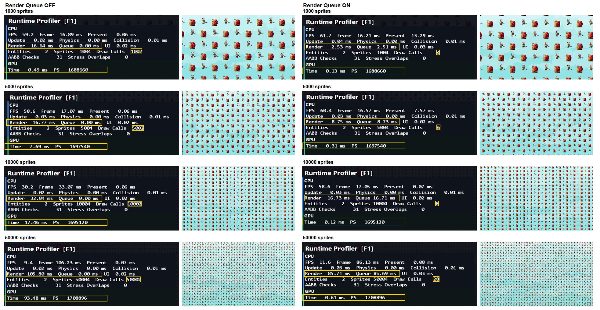

# DirectX 11 2D Action Game

C++20과 DirectX 11로 개발한 2D 액션 게임 프로토타입. Win32 게임 루프와 렌더링 파이프라인부터 게임 시스템까지 직접 구현.


<p align="center">
  <a href="https://github.com/Yeop-Git/DX11ScrollRPG/releases/tag/v0.1.0">
    
  </a>
</p>

## 목차

- [프로젝트 정보](#project-information)
- [조작법](#controls)
- [기본: 직접 작성한 코드](#handwritten-foundation)
  1. [DirectX 11 렌더링](#directx-rendering)
  2. [렌더링·리소스·애니메이션 구조](#system-architecture)
  3. [객체·물리·충돌](#entity-physics-collision)
  4. [FSM 기반 전투](#fsm-combat)
  5. [Active 상태 기반 재사용](#object-reuse)
- [AI Sprint: 성능 분석과 렌더링 개선](#ai-sprint)
  1. [Profiler와 스트레스 테스트](#profiler-stress-test)
  2. [Sprite Batch](#sprite-batch)
  3. [Depth Test와 픽셀 처리량](#depth-test)
  4. [Render Queue](#render-queue)
- [Thread Pool / Job Queue](#thread-pool)
- [JSON 설정과 비동기 로딩](#json-loading)
- [Sprint 진행 일정](#sprint-schedule)
- [빌드 및 실행](#build-and-run)
- [프로젝트 구조](#project-structure)
- [에셋 크레딧](#asset-credits)

<a id="project-information"></a>
## 프로젝트 정보

| 구분 | 내용 |
| --- | --- |
| 플랫폼 | Windows PC |
| 장르 | 2D 액션 게임 |
| 개발 인원 | 1명 |
| 개발 기간 | 2026.08 ~ 2026.10 |
| 기술 | C++20, Win32 API, DirectX 11, HLSL, stb_image, nlohmann/json |

<a id="controls"></a>
## 조작법

| 키 | 동작 |
| --- | --- |
| `←` / `→` | 좌우 이동 |
| `Alt` | 점프 |
| `Ctrl` | 공격 |
| `R` | 사망 후 재시작 |
| `F1` | Profiler 및 스트레스 테스트 패널 표시 전환 |

<a id="handwritten-foundation"></a>
## 기본: 직접 작성한 코드

### 1. DirectX 11 렌더링

#### 개발 배경

게임 엔진이 처리하는 그래픽스 파이프라인과 GPU 리소스의 역할을 익히기 위해 스프라이트 렌더링 과정을 직접 구성.

#### 구현 내용

- Win32 윈도우 및 Direct3D 11 Device, Device Context, Swap Chain 초기화
- Vertex / Index Buffer, Input Layout, HLSL Vertex / Pixel Shader 연결
- Shader Resource View와 Sampler를 이용한 텍스처 및 스프라이트 시트 출력
- Point Sampling 기반 픽셀 아트 출력, 프레임 UV 계산 및 좌우 반전
- `ComPtr` 기반 DirectX COM 리소스 수명 관리

#### 한계 및 개선점

- 창 크기 변경에 따른 Render Target 및 Viewport 재설정 필요

<a id="system-architecture"></a>
### 2. 렌더링·리소스·애니메이션 구조

#### 개발 배경

초기 `Application`에 모여 있던 초기화·리소스·갱신·렌더링 책임을 분리하고, 게임 로직에서 DirectX API와 텍스처 경로에 대한 의존성을 제거.

#### 구현 내용

- `Application`: 시스템 초기화와 게임 루프 관리
- `GameWorld`: 게임 객체와 월드 갱신 관리
- `RenderInfo`: 게임 객체에서 Renderer로 전달하는 스프라이트 출력 정보
- `Renderer`: 렌더 정보 기반 DirectX 렌더 명령 처리
- `ResourceManager`: 텍스처와 Shader Resource View 보관 및 수명 관리
- `AnimationClip`: 프레임 수, 재생 시간, 스프라이트 크기, Offset 보관
- `Animator`: 프레임 진행, Loop 및 재생 종료 처리

#### 한계 및 개선점

- Character 코드에 정의된 애니메이션 데이터의 외부 파일 또는 Asset Table 분리 필요
- `Application`에 남아 있는 UI 연결의 별도 책임 분리 필요

<a id="entity-physics-collision"></a>
### 3. 객체·물리·충돌

#### 개발 배경

Player와 Monster 사이 중복된 이동·중력·충돌 처리를 정리하고, 객체 역할과 물리·충돌·수명 관리 책임을 분리.

#### 구현 내용

- `GameObject → Entity → Character` 계층으로 공통 객체·갱신 대상·전투 캐릭터 구분
- `Transform`: 위치와 스케일 보관
- `Physics`: 속도, 중력 및 지면 상태 보관
- `Collider`: 충돌 크기와 오프셋 기반 AABB 계산
- `GameWorld`: Physics 갱신, AABB 검사 및 지면 충돌 보정
- `gameObjects_`: `unique_ptr<GameObject>`를 이용한 객체 수명 소유
- 시스템별 목록: 소유 객체를 가리키는 비소유 포인터 보관

#### 한계 및 개선점

- 지면 착지 중심의 충돌 반응. 벽·천장 및 고속 이동 충돌 처리는 미지원
- 객체 삭제 시 시스템별 비소유 참조 목록 갱신 필요
- 객체 증가에 대비한 Broad Phase 도입 필요

<a id="fsm-combat"></a>
### 4. FSM 기반 전투

#### 개발 배경

여러 Boolean 조합에서 발생하는 상충 상태를 방지하고, 몸체 충돌과 공격 판정을 독립적으로 관리.

#### 구현 내용

- Player: Idle, Run, Jump, Attack, Dead 상태
- Monster: Idle, Chase, Hurt, Dead 상태
- Grounded 및 Velocity 기반 Player 이동 애니메이션 전환
- 공격 애니메이션의 유효 프레임에 한정한 HitBox 활성화
- 공격당 대상별 중복 피격 방지
- Player 피격 시 무적 시간, 점멸 및 Knockback 적용

#### 한계 및 개선점

- 상태 증가에 대비한 상태별 동작 또는 Controller 분리 검토
- 현재 공격당 한 대상만 피격 처리. 다중 대상 공격 지원 필요

<a id="object-reuse"></a>
### 5. Active 상태 기반 재사용

#### 개발 배경

Monster와 Item의 반복적인 생성·삭제로 발생하는 메모리 할당을 줄이고, 재사용 시 초기화와 정리 시점을 명확히 구분.

#### 구현 내용

- Monster와 Item 사전 생성 및 `Active` 상태 기반 사용 관리
- `OnEnable()`: HP, Velocity, State 초기화
- `OnDisable()`: 전투·애니메이션·물리 상태 정리
- 사망 Monster의 Respawn Queue 등록
- 획득 Item의 재사용 Queue 반환

#### 한계 및 개선점

- Monster와 Item 흐름에 맞춘 개별 Pool 관리
- 재사용 대상 증가 시 공통 `ObjectPool<T>` 구조 검토

<a id="ai-sprint"></a>
## AI Sprint: 성능 분석과 렌더링 개선

직접 작성한 게임 시스템을 바탕으로 Profiler와 렌더링 최적화를 분석하고 확장하는 AI Sprint 작업.

<a id="profiler-stress-test"></a>
### 1. Profiler와 스트레스 테스트

#### 개발 배경

객체 수가 늘어날 때 프레임 비용이 집중되는 구간을 확인하고, 렌더링 최적화 전후를 비교할 기준선 마련.

#### 구현 내용

- `Application` 소유 Profiler 및 최근 최대 120프레임 평균 기록
- Frame, Update, Physics, Collision, Scene Render, UI Render, Present 측정
- Entity, Sprite, Draw Call, AABB 검사 수 표시
- 1,000 / 5,000 / 10,000 / 50,000 Stress Monster 생성
- GPU 시간과 Pixel Shader 호출 수 수집
- F1 패널에서 Depth Test와 스트레스 테스트 조건 제어

#### 한계 및 개선점

- GPU 시간이 1ms 미만인 구간은 측정 편차의 영향이 큼
- 상세 조건과 기준선은 [Profiler 측정 기록](Docs/ProfilerBaseline.md) 참고

<a id="sprite-batch"></a>
### 2. Sprite Batch

#### 개발 배경

Sprite별 Draw Call에서 발생하는 CPU 제출 비용을 줄이면서 기존 렌더 순서를 보존.

#### 구현 내용

- `DrawSprite`에서 사각형 정점 4개를 CPU 목록에 추가
- 텍스처, Profiler 계측 상태 변경 또는 2,048 Sprite 용량 도달 시 Flush
- Dynamic Vertex Buffer를 `WRITE_DISCARD`로 Map해 정점 복사
- 재사용 인덱스 버퍼로 누적 Sprite를 DrawIndexed 처리
- 실제 Batch 제출 성공 시 Sprite 및 Draw Call 카운터 갱신

| Stress Sprite | Draw Calls 전 → 후 | Scene Render 전 → 후 |
| ---: | ---: | ---: |
| 1,000 | 1,022 → 6 | 1.00 → 1.85 ms |
| 5,000 | 5,022 → 8 | 4.98 → 6.60 ms |
| 10,000 | 10,022 → 10 | 8.44 → 13.57 ms |
| 50,000 | 50,022 → 30 | 41.04 → 66.97 ms |


#### 한계 및 개선점

- Draw Call은 약 99% 이상 감소했지만 모든 측정 구간에서 Scene Render CPU 시간 증가
- 정점 계산, CPU 목록 작성·복사 및 Batch 분할 비용 추가 분석 필요
- 현재는 렌더 순서를 유지하기 위해 연속된 유사 요청만 Batch로 처리
- 서로 다른 텍스처 요청이 번갈아 나타나면 같은 텍스처를 사용하는 Sprite가 많더라도 Batch가 자주 끊겨 효율 감소

<a id="depth-test"></a>
### 3. Depth Test와 픽셀 처리량

#### 개발 배경

깊이 버퍼가 가려진 영역의 픽셀 셰이더 처리를 줄이는지 GPU 시간과 셰이더 호출 수로 확인.

#### 구현 내용

- 월드 Sprite에 Depth Test 적용 및 Profiler 패널에서 전환
- GPU 시간과 Pixel Shader 호출 수 수집
- 50,000 Stress Sprite에서 ON/OFF 측정


| Stress Sprite | GPU ms (ON → OFF) | PS Invocations (ON → OFF) | Scene Render ms (ON → OFF) | Frame ms (ON → OFF) | Draw Calls |
| ---: | ---: | ---: | ---: | ---: | ---: |
| 1,000 | 0.36 → 0.28 | 761,804 → 8,902,340 | 1.39 → 2.16 | 16.60 → 16.59 | 6 → 6 |
| 5,000 버튼 선택 (실제 500) | 0.58 → 1.25 | 1,675,407 → 38,882,099 | 6.93 → 8.97 | 16.83 → 18.62 | 8 → 8 |
| 10,000 | 0.74 → 2.27 | 2,063,266 → 78,192,054 | 13.74 → 18.00 | 33.68 → 37.52 | 10 → 10 |
| 50,000 | 1.67 → 11.46 | 29,449,766 → 376,943,225 | 67.88 → 89.77 | 167.68 → 189.64 | 30 → 30 |

#### 한계 및 개선점

- 50,000 구간에서 Depth Test ON의 GPU 시간 약 85% 감소, Pixel Shader 호출 수 약 92% 감소
- Render CPU 병목은 남아 있어 추가 최적화 필요

<a id="render-queue"></a>
### 4. Render Queue

#### 개발 배경

Player와 Monster 스프라이트 요청이 번갈아 들어오는 조건에서 연속 Batch만 사용할 때와 Queue로 텍스처별 요청을 모을 때의 Draw Call 및 CPU Render 비용을 비교.

#### 구현 내용

- 렌더 요청을 레이어와 텍스처 기준으로 모은 뒤, 레이어 순서에 따라 Queue를 제출
- 같은 텍스처 묶음 안의 Sprite 순서는 유지하고, 깊이 테스트가 켜진 Cutout 요청만 같은 레이어 안에서 텍스처별로 모음
- Queue 제출 시 기존 Sprite Batch를 사용하고, 투명 Sprite는 Queue 대상에서 제외
- Player와 Monster Sprite를 교차 배치한 렌더 전용 스트레스 테스트 추가
- Batch, Queue, Depth Test 및 테스트 패턴을 Profiler에서 전환
- Profiler에 CPU와 GPU 측정값을 구분해 표시



| Sprite 수 | Draw Calls (OFF → ON) | Render / Queue CPU (ms, OFF → ON) | GPU Time (ms, OFF → ON) | PS Invocations (OFF → ON) |
| ---: | ---: | ---: | ---: | ---: |
| 1,000 | 1,002 → 4 | 16.64 / 0.00 → 2.53 / 2.51 | 0.49 → 0.13 | 168,860 → 168,860 |
| 5,000 | 5,002 → 6 | 16.77 / 0.00 → 8.75 / 8.73 | 7.69 → 0.31 | 169,540 → 169,540 |
| 10,000 | 10,002 → 8 | 32.84 / 0.00 → 16.73 / 16.71 | 17.46 → 0.12 | 1,695,120 → 1,695,120 |
| 50,000 | 50,002 → 28 | 105.80 / 0.00 → 85.71 / 85.69 | 93.48 → 0.61 | 1,708,896 → 1,708,896 |

#### 한계 및 개선점

- Draw Calls는 크게 줄었지만, 50,000 Sprite에서 Render CPU 시간은 85.71 ms로 남음. Queue는 텍스처 상태 변경과 제출 횟수를 줄이며, Sprite별 정점 준비 비용은 여전히 발생.
- Queue 시간은 요청 수집부터 Queue 제출까지의 구간으로 Render 시간에 포함. 두 값을 더해 전체 비용으로 해석하지 않음.
- 측정에서 PS Invocations는 Queue 전후 동일. GPU Time 감소만으로 픽셀 처리량 감소를 판단할 수 없음.
- 투명 Sprite는 순서 보존을 위해 Queue에서 제외. Depth Test를 끄면 요청 재정렬을 허용하지 않아 Queue 효과가 적용되지 않음.

<a id="thread-pool"></a>
## Thread Pool / Job Queue

인자 없는 `std::function<void()>` 작업을 받는 최소 JobSystem. 고정 Worker들이 단일 Queue에서 작업을 꺼내며, `mutex`와 `condition_variable`로 접수·대기·종료를 제어합니다. Stop은 새 작업을 거부하고 이미 접수한 작업을 모두 처리한 뒤 Worker를 join합니다.

Application이 JobSystem Worker 하나를 시작하고 실제 JSON 파일 읽기·파싱·검증을 제출합니다. 기존 JobSystemTests 콘솔 프로젝트는 제거했습니다. 공통 작업은 계속 `std::function<void()>`이며, 로더의 `promise/future`가 결과와 오류를 메인 스레드에 전달합니다. [Thread Pool 계약](Docs/ThreadPool.md), [JSON 로딩 구조와 검증](Docs/GameData.md)을 참고합니다.

<a id="json-loading"></a>
## JSON 설정과 비동기 로딩

Player / Monster 생성자에 있던 정적 정의를 [GameData.json](Assets/Data/GameData.json)으로 분리했습니다. JSON을 수정하고 게임을 다시 실행하면 재컴파일 없이 설정을 적용합니다.

| 분리한 데이터 | 내용 |
| --- | --- |
| AnimationClip 10개 | 프레임 수·재생 간격·반복 여부·프레임 크기·렌더 크기·offset |
| Player / Monster 설정 | 초기 HP·시작 위치·충돌 크기·이동 및 피격 수치·공격 유효 프레임과 범위 |
| 텍스처 경로 17개 | SpriteId별 이미지 파일 경로 |

```text
Application → JobSystem.Submit
    → Worker: 파일 읽기 → JSON 파싱·검증 → promise에 결과 또는 예외 저장
    → Main: future 완료 확인 → 리소스 생성 → GameWorld 초기화
```

Application이 불변 GameData를 소유하며 Player와 Monster는 이를 읽기 전용으로 참조합니다. 현재 HP, FSM, Animator의 현재 프레임과 시간은 객체별 실행 상태로 유지합니다. 설정은 GameWorld보다 오래 생존하며 종료 시 Worker를 먼저 join합니다.

로딩 중에도 창 메시지를 처리합니다. 필수 키·타입·수치·클립 반복 규칙 등이 잘못되면 오류를 표시하고 게임 시작을 중단합니다. 파서는 MIT 라이선스의 nlohmann/json 3.12.0을 사용하며 [라이선스](Engine/ThirdParty/nlohmann/LICENSE.MIT)를 함께 포함합니다.

검증 결과:

- Debug / Release x64 게임 빌드 성공.
- 기존 10개 클립의 모든 값 보존과 JSON 수정값의 캐릭터·Animator 반영 확인.
- 실제 로더·캐릭터 초기화·공격 프레임·풀 재활성화 및 오류 18건 검증 통과.
- 실제 JobSystem의 결과·예외 전달과 종료 처리 확인. Debug 게임 기동 및 정상 종료 확인.

현재는 시작 시 한 번 로딩하며 핫 리로드는 지원하지 않습니다. PNG 디코딩과 D3D 리소스 생성, 입력·게임 갱신·렌더링은 메인 스레드에서 수행합니다. 화면 육안 회귀 검증과 성능 개선 측정은 미실행입니다. 파일별 역할·소유권·스키마·검증 범위는 [개발 로그](Docs/GameData.md)에 정리했습니다.

<a id="sprint-schedule"></a>
## Sprint 진행 일정

2026.09.26 기준, 하루 4~6시간의 목표 일정입니다. 상세한 의존 관계·이월 기준은 [작업 계획](Docs/SprintWorkPlan.md), 기능별 계약·검증 기준은 [요구사항 명세](Docs/Requirements.md)를 참고합니다. 날짜는 완료 기록이 아닙니다.

| 날짜 / 상태 | 작업 | 완료 목표 |
| --- | --- | --- |
| 기존 구현·측정 자료 기록 | Profiler / Stress Test, Sprite Batch, Depth Test, Render Queue | 기존 결과와 한계 보존 |
| 09.26 · 구현·자동 검증 | Thread Pool / Job Queue | 시작 시 JSON 로딩에 사용. 사용자 육안 검토는 별도 |
| 09.26 · 구현·자동 검증 | AnimationClip JSON·비동기 로딩 | 클립·캐릭터 설정·텍스처 경로를 외부화, Worker 로딩 후 메인 스레드 초기화 |
| 09.27 목표 | 공격 구조·Projectile Pool·Q | Ctrl 공격 유지, Q 투사체와 3초 쿨타임 |
| 09.28 목표 | W/E/R·Effect Pool·Handle / Lookup | 5/7/30초 쿨타임, 명중 효과, Pool 반환·재사용 시 이전 Handle 무효화 |
| 09.29 목표 | IOCP Echo Server | Session·비동기 Receive/Send·Disconnect·안전한 종료 |
| 09.30 목표 | Packet Framing·2 Client | 부분/병합 패킷, Spawn/Despawn·기본 이동 동기화 |
| 10.01 목표 | Interpolation·서버 권위 이동 | 원격 이동 보간, 서버가 입력으로 위치 계산 |
| 10.02 목표 | 통합 검증·기록, 여유 시 Spatial Hash | 검증·기록 시간을 우선 확보하고 Broad Phase 전후 비교 |
| 10.02 이후 후순위 | Offscreen·Post Processing·HP Vignette | 네트워크·충돌 후속 작업 이후 진행 |

Q/W/E/R 에셋·동작 추천안은 Fire_Ball / Wind / Earth_Spike / Tornado이며 Q 명중에는 Explosion을 활용합니다. 쿨타임은 확정값이고, 공격 판정·피해량·수명 등은 구현 전 설계 선택이 필요합니다. 분석한 Foozle ZIP은 효과 64×64, 아이콘 32×32, CC0이며 게임에는 아직 등록하지 않았습니다.

Projectile / HitEffect는 Pool로 처리합니다. Handle / Lookup / Generation은 실제 삭제를 억지로 도입하기 위한 것이 아니라, 재사용 시 참조 유효성을 구현·검증하는 포트폴리오 학습 목적입니다. 현재 입력·GameWorld 갱신·렌더링은 메인 스레드에서 유지합니다. JSON 로딩 결과는 메인 스레드에서 적용하며, 향후 네트워크 상태 반영도 같은 원칙을 따르고, IOCP와 일반 Job Queue는 구분합니다.

Sprite Batch / Render Queue 경계 조건 검증 기록은 이번 일정에서 제외합니다. Depth 비교의 5,000 버튼 캡처는 실제 500개라는 기존 표기와 한계를 유지하며 재측정을 요구하지 않습니다. 일정이 밀리면 Spatial Hash를 먼저 이월하고 10.02 통합 검증 시간을 보존합니다. 맵 ID·배치·Spawn 정보 JSON은 장기 확장입니다.

<a id="build-and-run"></a>
## 빌드 및 실행

### 요구 사항

- Windows 10 이상
- Visual Studio 및 MSVC v145 Platform Toolset
- Windows 10 SDK
- DirectX 11 지원 GPU

### 실행

1. 저장소 복제

   ```bash
   git clone https://github.com/Yeop-Git/DX11ScrollRPG.git
   cd DX11ScrollRPG
   ```

2. Visual Studio에서 `DX11ScrollRPG.slnx` 열기
3. `x64`와 `Debug` 또는 `Release` 구성 선택 후 빌드 및 실행

셰이더·텍스처·JSON이 상대 경로를 사용하므로 작업 디렉터리는 저장소 루트로 설정. `Assets/Data/GameData.json`은 실행에 필요한 필수 파일입니다.

<a id="project-structure"></a>
## 프로젝트 구조

```text
DX11ScrollRPG/
├─ Assets/                 # Data/GameData.json, 게임 텍스처
├─ Engine/
│  ├─ Core/                # Application, JobSystem, Game Loop, Profiler, UI
│  ├─ Graphics/            # Renderer, ResourceManager, RenderInfo
│  ├─ Math/                # Vector2
│  └─ ThirdParty/          # stb_image, nlohmann/json 및 라이선스
├─ Game/
│  ├─ Animation/           # AnimationClip, Animator
│  ├─ Collision/           # AABB
│  ├─ Data/                # GameData 정의와 JSON 로더
│  ├─ Entity/              # GameObject, Entity, Character, Physics
│  ├─ World/               # GameWorld, Ground, WorldItem
│  ├─ Player.cpp
│  └─ Monster.cpp
└─ Shaders/                # HLSL Vertex / Pixel Shader
```

<a id="asset-credits"></a>
## 에셋 크레딧

Anokolisa의 [Legacy-Fantasy - High Forest 2.0](https://anokolisa.itch.io/sidescroller-pixelart-sprites-asset-pack-forest-16x16) 그래픽 리소스 사용. 저작권 및 이용 조건은 원저작자 배포 페이지 기준.
